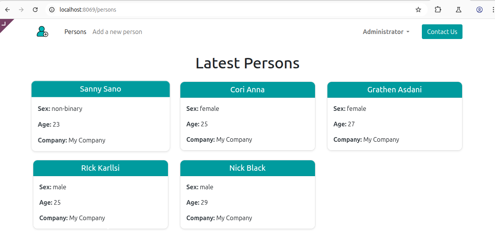
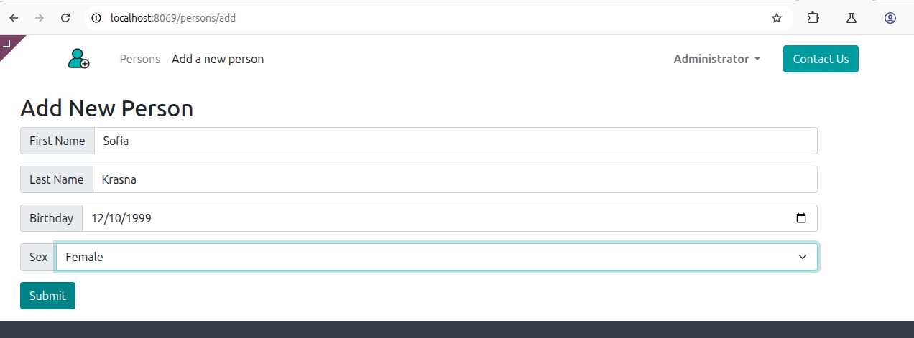
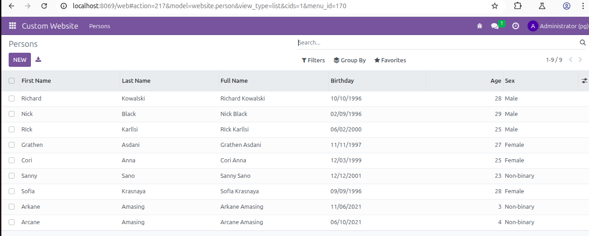
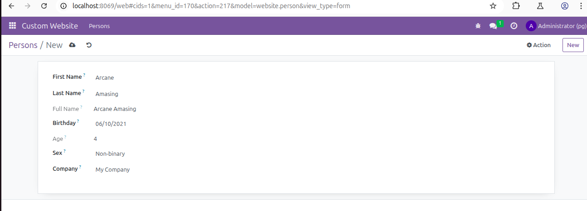

# Website Persons – Custom Odoo Module

A simple Odoo 16 custom module that allows you to:
- View a list of persons on the website
- Add new persons using a public form
- Store and display fields like first name, last name, birthday, age, sex, and company

---

## 📁 Project Structure

```custom_addons/
└── website_persons/
├── init.py
├── manifest.py
├── models/
│ ├── init.py
│ └── person.py
├── controllers/
│ ├── init.py
│ └── website_person.py
├── templates/
│ └── website_person_template.xml
└── views/
└── person_views.xml
```

---

## ⚙️ Features Implemented

### ✅ Backend (Model)
Defines a `website.person` model:
```python
first_name: Char (required)
last_name: Char (required)
full_name: computed field (first + last)
birthday: Date
age: computed field
sex: selection (male, female, non-binary)
company_id: linked to res.company
```
### ✅ Frontend (Controller + Templates)
 - /persons: shows latest 5 persons (via template)
 - /persons/add: public form to add a new person
 - Templates styled using Bootstrap via Odoo website theme.

---

## 🚀 How to Run the App Locally

### 1. Install Python dependencies
First, activate your virtual environment, then install required packages:
```bash
cd /path/to/your/odoo16 # navigate to your root project directory
python3 -m venv venv # crete virtual environment
# Activate the virtual environment
source venv/bin/activate # On Linux/macOS:
venv\Scripts\activate # On Windows:
pip install -r requirements.txt # install dependencies
```
**Make sure PyPDF2, werkzeug, psycopg2, etc., are included.**

### 2. Set up PostgreSQL Manually (if Odoo can’t create DB)
If your Odoo user doesn't have permission to create databases, you can do it manually like this:

🔹 Step 1: Switch to PostgreSQL user
```bash
sudo -u postgres psql
```
🔹 Step 2: Create a new database
Replace pg with your preferred DB name:
```sql
CREATE DATABASE pg;
```
🔹 Step 3: Create a PostgreSQL user (if needed)
If you haven’t created a DB user yet:
```sql
CREATE USER nick WITH PASSWORD 'your_password';
```
Grant the user privileges on the database:
```sql
GRANT ALL PRIVILEGES ON DATABASE pg TO nick;
```
Exit the PostgreSQL shell:
```sql
\q
```
🔹 Step 4: Ensure odoo.conf matches your DB setup
In your odoo.conf file, make sure:
```ini
db_user = nick
db_password = your_password
db_host = False  # or 'localhost'
db_port = False  # or '5432'
```

### 3. Launch Odoo with module

```bash
cd ~/odoo16
./odoo-bin -c /home/nick/odoo16/odoo.conf -d pg -u website_persons --dev=all
```
Explanation:
```-c: path to your odoo.conf
-d: name of the PostgreSQL DB (example: pg)
-u website_persons: update/install the module
--dev=all: enables developer mode with full logs
```

### 4. Open in browser:

Navigate to: http://localhost:8069
Log in, activate developer mode, and ensure the Website Persons module is installed.

## 📄 Add Person Form Usage

Visit: http://localhost:8069/persons
To see the person list.

Then go to: http://localhost:8069/persons/add
To add a new person via public form.

## 🛠️ Notes

 - This module depends on the website module
 - You can style your pages with standard Bootstrap classes
 - Make sure to restart Odoo after any changes

## ✅ Manifest Example

```
{
    'name': 'Website Persons',
    'version': '1.0',
    'depends': ['website'],
    'data': [
        'views/person_views.xml',
        'templates/website_person_template.xml',
    ],
    'application': True,
}
```

## Demo 🚀



---



---



---


